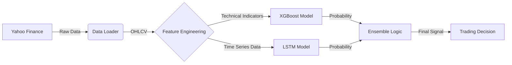

# 📈 AI Algorithmic Trading System (AI 트레이딩 봇)> **"데이터는 거짓말을 하지 않습니다."** > 머신러닝(XGBoost)과 딥러닝(LSTM)의 강력한 앙상블로 시장의 흐름을 읽어내는 차세대 트레이딩 시스템입니다.---## 📑 목차 (Table of Contents)1. [🔍 프로젝트 개요 (Overview)](#-프로젝트-개요-overview)2. [🏗️ 시스템 아키텍처 (Architecture)](#-시스템-아키텍처-architecture)

3. [🧠 핵심 기술 및 알고리즘 (Core Technology)](#-핵심-기술-및-알고리즘-core-technology)
4. [🛠️ 설치 및 환경 설정 (Installation)](#-설치-및-환경-설정-installation)
5. [💻 사용 가이드 (User Guide)](#-사용-가이드-user-guide)
6. [📊 분석 지표 상세 (Technical Indicators)](#-분석-지표-상세-technical-indicators)
7. [📂 디렉토리 구조 (Directory Structure)](#-디렉토리-구조-directory-structure)
8. [⚠️ 주의사항 (Disclaimer)](#-주의사항-disclaimer)

---

## 🔍 프로젝트 개요 (Overview)

이 프로젝트는 주식 시장의 방대한 데이터를 인간이 아닌 **AI의 시각**으로 분석합니다.  
감정에 휘둘리는 매매를 멈추고, **수학적 확률**에 기반한 냉철한 트레이딩을 지원하기 위해 개발되었습니다.

### 🎯 주요 목표

- **자동화**: 데이터 수집부터 분석, 예측까지 원클릭으로 수행
- **객관성**: 20여 가지 기술적 지표를 통한 정량적 분석
- **정확성**: 서로 다른 장점을 가진 두 가지 AI 모델(XGBoost + LSTM)의 교차 검증

---

## 🏗️ 시스템 아키텍처 (Architecture)

데이터가 어떻게 흐르고 처리되는지 보여주는 전체 구조도입니다.



1.  **Data Loader**: 야후 파이낸스 서버에서 실시간 주가 데이터를 수집하고 로컬에 캐싱합니다.
2.  **Feature Engineering**: 원본 데이터를 가공하여 AI가 학습할 수 있는 보조지표를 생성합니다.
3.  **Model Training**: 두 개의 모델이 독립적으로 학습을 수행합니다.
4.  **Ensemble Prediction**: 두 모델의 예측 결과를 종합하여 최종 매매 신호를 생성합니다.

---

## 🧠 핵심 기술 및 알고리즘 (Core Technology)

### 1. Hybrid AI Model (앙상블 모델)

| 모델 (Model) | 역할 (Role)          | 특징 (Characteristics)                                                                                                |
| :----------- | :------------------- | :-------------------------------------------------------------------------------------------------------------------- |
| **XGBoost**  | **정형 데이터 분석** | • 트리 기반의 부스팅 알고리즘<br>• 과적합 방지 및 피처 중요도 산출에 탁월<br>• "현재 지표 상태"를 보고 상승/하락 분류 |
| **LSTM**     | **시계열 패턴 분석** | • 순환 신경망(RNN)의 일종<br>• 긴 기간의 데이터 흐름(Context)을 기억<br>• "차트의 모양과 추세"를 보고 미래 예측       |

### 2. Smart Data Pipeline

- **자동 결측치 처리**: 데이터가 비어있는 구간을 자동으로 보정합니다.
- **정규화 (Scaling)**: 서로 다른 단위의 지표들을 0~1 사이로 변환하여 AI 학습 효율을 높입니다.
- **윈도우 슬라이딩**: 시계열 데이터를 학습 가능한 시퀀스 형태로 자동 변환합니다.

---

## 🛠️ 설치 및 환경 설정 (Installation)

### 1. 필수 요구사항

- OS: Windows, macOS, Linux
- Python: 3.8 이상
- Git

### 2. 설치 명령어

터미널(CMD, PowerShell)을 열고 아래 명령어를 한 줄씩 입력하세요.

```bash
# 1. 프로젝트 다운로드 (Clone)
git clone https://github.com/cel0843/tradeBotTest1.git
cd tradeBotTest1

# 2. 가상환경 생성 (권장)
# 프로젝트 격리를 위해 가상환경을 만드는 것이 좋습니다.
python -m venv .venv

# 3. 가상환경 활성화
# Windows:
.venv\Scripts\activate
# Mac/Linux:
# source .venv/bin/activate

# 4. 라이브러리 설치
# 학습에 필요한 모든 패키지를 한 번에 설치합니다.
pip install -r requirements.txt
```

---

## 💻 사용 가이드 (User Guide)

### STEP 1: 분석 대상 종목 설정

`src/config.py` 파일을 열어 `DEFAULT_SYMBOLS` 리스트를 수정합니다.

```python
# src/config.py

DEFAULT_SYMBOLS = [
    "AAPL", "MSFT", "NVDA",  # 기술주
    "SPY", "QQQ",            # 지수 ETF
    "BTC-USD",               # 암호화폐도 가능 (야후 파이낸스 티커 기준)
    "005930.KS"              # 한국 주식 (삼성전자) 예시
]
```

### STEP 2: AI 모델 학습 (Training)

설정된 종목의 과거 데이터를 학습시킵니다.

```bash
python -m src.model_train
```

> **Tip**: 학습이 완료되면 `models/` 폴더에 `.pkl` (XGBoost) 및 `.pth` (LSTM) 파일이 생성됩니다.

### STEP 3: 매매 신호 예측 (Prediction)

오늘 장이 열리면(혹은 닫힌 후) 매매 신호를 확인합니다.

```bash
python -m src.model_predict
```

#### 🖥️ 실행 결과 예시

```text
[매수 추천 종목 (확률순)]
symbol      close  probability
  NVDA 183.779999     0.699147  <-- 🔥 강력 매수 신호 (확률 약 70%)
  AAPL 278.779999     0.586623  <-- 👍 매수 신호 (확률 약 59%)
  MSFT 478.559998     0.564683  <-- 👍 매수 신호 (확률 약 56%)
```

- **Probability**: AI가 예측한 상승 확률입니다. 0.5(50%)를 넘으면 상승을 예측한 것입니다.

---

## 📊 분석 지표 상세 (Technical Indicators)

AI가 학습에 사용하는 20여 가지의 보조지표 목록입니다.

| 카테고리                | 지표 이름               | 설명                                      |
| :---------------------- | :---------------------- | :---------------------------------------- |
| **추세 (Trend)**        | **MA (Moving Average)** | 5일, 20일, 60일 이동평균선                |
|                         | **MACD**                | 장단기 이동평균 수렴/확산 지수            |
|                         | **Bollinger Bands**     | 주가의 변동폭을 나타내는 밴드 (상단/하단) |
| **모멘텀 (Momentum)**   | **RSI**                 | 상대강도지수 (과매수/과매도 판단)         |
|                         | **Stochastic**          | 주가의 현재 위치를 백분율로 표시          |
| **변동성 (Volatility)** | **ATR**                 | 평균 진폭 (시장의 변동성 크기)            |
|                         | **Volatility**          | 주가 수익률의 표준편차                    |
| **거래량 (Volume)**     | **Volume MA**           | 거래량 이동평균                           |
|                         | **Volume Ratio**        | 전일 대비 거래량 변화율                   |

---

## 📂 디렉토리 구조 (Directory Structure)

```text
tradeBot/
├── 📁 data/              # [자동생성] 수집된 주가 데이터가 저장되는 캐시 폴더
├── 📁 models/            # [자동생성] 학습된 AI 모델 파일이 저장되는 폴더
├── 📁 src/               # 소스 코드 메인 디렉토리
│   ├── 📄 config.py      # [설정] 종목, 기간, 하이퍼파라미터 설정
│   ├── 📄 data_loader.py # [데이터] 야후 파이낸스 데이터 수집기
│   ├── 📄 features.py    # [전처리] 기술적 지표 계산 로직
│   ├── 📄 model_train.py # [학습] 모델 학습 및 저장 실행 파일
│   ├── 📄 model_predict.py # [예측] 매매 신호 생성 실행 파일
│   └── 📄 backtest.py    # [검증] 수익률 시뮬레이션 도구
├── 📄 .gitignore         # Git 제외 파일 목록
├── 📄 requirements.txt   # 의존성 패키지 목록
└── 📄 README.md          # 프로젝트 설명서
```

---

## ⚠️ 주의사항 (Disclaimer)

1.  **투자 책임**: 본 시스템이 제공하는 정보는 투자를 위한 참고 자료일 뿐이며, 투자의 최종 책임은 사용자 본인에게 있습니다.
2.  **데이터 지연**: 무료 API(Yahoo Finance)를 사용하므로 실시간 데이터에 약간의 지연이 있을 수 있습니다.
3.  **과적합 주의**: 과거의 수익률이 미래의 수익을 보장하지 않습니다.

---

<div align="center">
  <sub>Built with ❤️ by AI Developer</sub>
</div>
